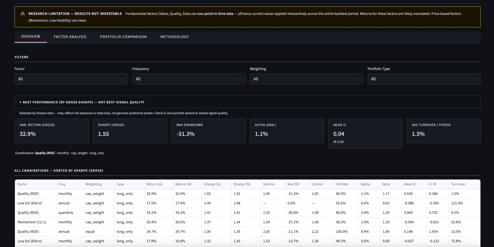

# Factor Model + Backtesting Engine

*Built by a CFA student to demonstrate institutional-grade factor research.*

A systematic multi-factor equity model covering the S&P 500 universe (~500 stocks). It computes five academic factors at each rebalance date, normalizes them to cross-sectional percentile ranks, constructs long-only and long-short quintile portfolios, and runs a rigorous backtest from 2016 to 2026 with full institutional analytics. Built to demonstrate that factor investing is an engineering problem as much as a finance one, signal construction, lookahead prevention, cost modeling, and statistical evaluation all have to be right.



---

## What This Demonstrates

- **Factor investing mechanics**: correct implementation of the Fama-French size premium, momentum (12-1 with reversal skip), the low-volatility anomaly, and earnings yield, each with documented financial rationale, not just code.
- **Backtest discipline**: strict signal-timing enforcement (scores computed at `t`, returns measured from `t` to `t+1`), warmup periods isolated from the evaluation window, and known biases disclosed rather than hidden.
- **Production-grade engineering**: one file per responsibility, all parameters in `config.yaml`, edge cases handled (NaN propagation, zero market cap, missing returns), 166 tests passing.
- **Institutional analytics**: Sharpe, Sortino, Calmar, max drawdown, hit rate, Information Coefficient (Spearman), and Jensen's alpha via OLS regression, the metrics an actual PM or risk team would ask for.

---

## Features

| Engine | Dashboard |
|--------|-----------|
| 5 individual factors + equal-weighted composite | Equity curves: gross vs. net, vs. SPY |
| Cross-sectional percentile ranking at each rebalance | Quintile return spread (Q1 through Q5) |
| Long-only (Q5) and long-short (Q5 − Q1) portfolios | IC time series and ICIR summary |
| Equal-weight and cap-weight schemes | Alpha / beta regression output |
| Monthly, quarterly, and annual rebalancing | Gross vs. net performance table |
| 10 bps one-way transaction cost model | Config-driven: change any parameter without touching code |

---

## Quick Start

```bash
git clone https://github.com/FrancoisRost1/factor-backtest-engine.git
cd factor-backtest-engine
pip install -r requirements.txt
python main.py
```

To launch the interactive dashboard:

```bash
streamlit run app/streamlit_app.py
```

Data is fetched from yfinance on first run and cached locally. No API key required. Subsequent runs use the cache.

---

## Factor Definitions

| Factor | Metric | Direction | Source |
|--------|--------|-----------|--------|
| Value | Earnings Yield (1 / PE ratio) | Higher = better | yfinance `trailingPE` |
| Momentum | 12-month return minus last 1 month (12-1) | Higher = better | yfinance price history |
| Quality | Return on Equity (ROE) | Higher = better | yfinance `returnOnEquity` |
| Size | log(market cap), inverted | Smaller = higher score | yfinance `marketCap` |
| Low Volatility | 60-day rolling stdev of daily returns, inverted | Lower vol = higher score | yfinance price history |

One metric per factor. No multi-metric blends or composite sub-factors at the definition stage.

---

## How It Works

**Universe and data.** The backtest runs on current S&P 500 constituents (~500 tickers). Daily adjusted close prices are downloaded via yfinance from 2014 to 2026 and cached locally. Fundamental data (trailing P/E, ROE, market cap) is fetched once per ticker. The 2014-2016 period serves as a warmup window only, rebalancing begins in January 2016 to ensure all lookback windows (12-month momentum, 60-day volatility) are fully populated before the first trade.

**Factor computation and normalization.** At each rebalance date, all five factors are computed using only data available up to that date, no future prices are accessed. Earnings yield and ROE come from the fundamentals snapshot; momentum is `price(t−1m) / price(t−12m) − 1` with the most recent month skipped to avoid short-term reversal; rolling volatility is the annualized standard deviation of the last 60 trading days of returns. Every factor is then percentile-ranked cross-sectionally so that all five signals live on a common `[0, 1]` scale. A sixth composite signal averages the five ranked scores for each stock, requiring at least three valid factor values to produce a composite.

**Portfolio construction.** At each rebalance the ranked universe is sorted into five equal quintiles. Q5 holds the highest-scoring stocks; Q1 holds the lowest. Two portfolio types are constructed: a long-only portfolio fully invested in Q5, and a long-short portfolio that goes long Q5 at +0.5 gross weight and short Q1 at −0.5 gross weight (dollar-neutral). Both are available in equal-weight and cap-weight variants.

**Backtesting loop and signal timing.** The engine iterates over consecutive rebalance date pairs `[t_start, t_end]`. Factor scores are computed at `t_start` using only historical data; portfolio weights are set at `t_start`; period returns are measured from `t_start` to `t_end`. The result index is keyed to `t_end`, making the timing convention explicit and auditable. This is verified in the test suite by confirming that multiplying all prices after a signal date by 1000 has zero effect on the scores computed at that date.

**Transaction costs.** At each rebalance, turnover is computed as the sum of absolute weight changes across all positions (comparing previous target weights to current target weights). Net return equals gross return minus `turnover × 10 bps`. Both gross and net returns are carried through all analytics.

**Analytics.** For each of the 72 backtest combinations (6 factors × 3 frequencies × 2 weighting schemes × 2 portfolio types), the engine computes annualized return (CAGR), Sharpe ratio, Sortino ratio, maximum drawdown, Calmar ratio, hit rate vs. SPY, average turnover, mean IC, ICIR (IC information ratio = mean IC / std IC), Jensen's alpha, beta, and R² from OLS regression against SPY returns.

---

## Project Structure

```
factor-backtest-engine/
├── CLAUDE.md
├── README.md
├── config.yaml
├── requirements.txt
├── main.py                          # Orchestrator only
│
├── factor_engine/
│   ├── universe.py                  # S&P 500 ticker list + SPY benchmark
│   ├── data_loader.py               # yfinance fetch: prices + fundamentals
│   ├── cache.py                     # Local caching to avoid re-fetching
│   ├── factors.py                   # 5 factor computations (one function each)
│   ├── normalize.py                 # Cross-sectional percentile ranking
│   ├── portfolio.py                 # Quintile sort + portfolio construction
│   ├── backtest.py                  # Backtest loop: signal → hold → return
│   ├── transaction_costs.py         # Turnover + cost calculation
│   ├── analytics.py                 # Sharpe, Sortino, drawdown, Calmar, hit rate
│   ├── ic.py                        # Information Coefficient computation
│   ├── regression.py                # Alpha/beta regression vs SPY
│   └── utils.py                     # Shared helpers (safe division, date utils)
│
├── app/
│   └── streamlit_app.py             # Dashboard
│
├── tests/
│   ├── test_factors.py
│   ├── test_normalize.py
│   ├── test_portfolio.py
│   ├── test_ic_regression.py
│   ├── test_analytics.py
│   └── test_end_to_end.py
│
├── data/
│   ├── raw/                         # Raw yfinance downloads
│   ├── processed/                   # Factor scores, portfolios, returns
│   └── cache/                       # Cached API responses
│
├── docs/
│   └── analysis.md                  # Investment thesis + methodology
│
└── outputs/
    └── backtest_results.csv
```

---

## Known Limitations

**Survivorship bias.** The universe is today's S&P 500 membership applied to the full backtest period. Companies that were in the index in 2016 but subsequently delisted, went private, or were removed are excluded. This overstates the investable opportunity set and biases results upward.

**Fundamental factors are not point-in-time.** Value (earnings yield), Quality (ROE), and Size (market cap) use today's yfinance values applied uniformly across all historical rebalance dates. A company's current P/E is used for its 2016 rebalance and its 2024 rebalance alike. This introduces look-ahead bias into three of the five factors. Momentum and Low Volatility are genuinely point-in-time because they derive entirely from historical price data filtered to the signal date.

**Target-to-target turnover.** Transaction costs are computed by comparing target portfolio weights at consecutive rebalance dates. Price drift between rebalances shifts weights away from targets, so the actual cost incurred at rebalance is lower than the target-to-target estimate. This overstates costs for low-frequency (annual) strategies.

**No sector neutralization.** Factor scores are ranked across the full cross-section without controlling for sector composition. A value-heavy portfolio will systematically overweight certain sectors (e.g., energy, financials) relative to a sector-neutral construction.

**No shorting costs.** The long-short portfolio assumes zero cost of borrow. In practice, small-cap and high-volatility short positions, exactly the stocks that populate Q1, carry meaningful financing costs that are not modeled here.

---

## Tech Stack

| Library | Purpose |
|---------|---------|
| pandas | All data manipulation and time-series operations |
| numpy | Numerical computations, array operations |
| yfinance | Price history and fundamental data (no API key required) |
| scipy | Spearman rank correlation for Information Coefficient |
| PyYAML | Configuration loading from `config.yaml` |
| streamlit | Interactive dashboard |
| plotly | Charts within the dashboard |
| pytest | 166-test suite covering factors, portfolio, analytics, end-to-end |

---

## Author

François Rostaing, [GitHub](https://github.com/FrancoisRost1)
